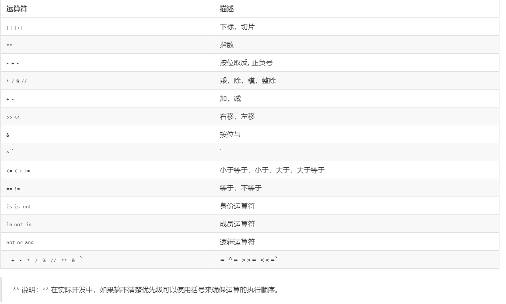

# 20190511
学习50天的第二天，很惭愧啊，第一天没能按照原计划进行，到第二天中间又拖了这么久，这是要向全国人民谢罪的

## 第二天
语言元素

### 二进制与10进制的互相转换
#### 二进制转10进制
 其实很简单，整数就是某位数乘以2的其位数减1的次方。比如$10011（2）=1*2^4+0*2^3+0*2^2+1*2^1+1*2^0=19$
 如果是小数的话，比如$0.1101(2)=0*2^0+1*2^(-1)+1*2^(-2)+0*2^(-3)+0*2^(-4)=0.8125

#### 10进制转2进制
整数部分，除2取余法，余数逆序
比如10.25
10/2=5 .... 0
5/2 = 2.... 1
2/2 = 1.... 0
1/2 = 0.... 1
小数部分，乘2取整法，余数正序
0.25 * 2 = 0.5 ... 0
0.5 * 2  = 1   ... 1
10.25(10)=1010.01(2)
 整数的负数，要遵循负反加一

### 二进制转换为8进制和16进制
8进制就是三个数凑成一组，16进制就是4位数凑成一组
如110100101001 = 110 100 101 001 = 6451
110100101001 = 1101 0010 1001 = D29

### 变量和类型
五种常见类型：整数(int)，浮点数(float)，字符串(complex)，布尔(str)，复数(bool)
PS：括号中的英文在python中就是一个函数，可用于数据类型的转换

### 运算符
直接贴图

