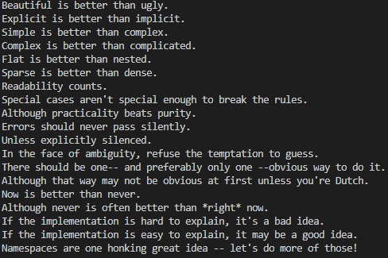
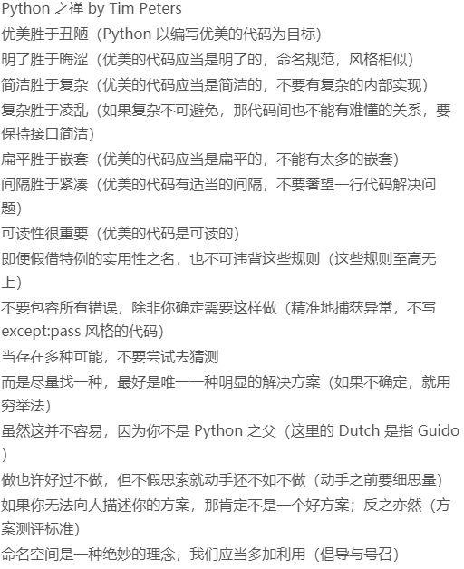
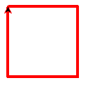

# learn-python
记录python的学习之旅

# 20190507
今天看到两个介绍python学习的GitHub项目，想跟着学习https://github.com/jackfrued/Python-100-Days/，
开了这个项目
## 第一天

### hello.py
#### print逗号就是空格
```Python
print('你好', '世界')
```

#### Python之禅
```Python
import this
```

##### 中文翻译

#### turtle绘制图形
```Python
import turtle

turtle.pensize(4)
turtle.pencolor('red')
turtle.forward(100) #初始默认向右画
turtle.right(90) #右转
turtle.forward(100)
turtle.right(90)
turtle.forward(100)
turtle.right(90)
turtle.forward(100)
turtle.mainloop()
```
