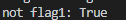
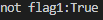

# learn-python
记录python的学习之旅

# 20190507
今天看到两个介绍python学习的GitHub项目，想跟着学习https://github.com/jackfrued/Python-100-Days/，
开了这个项目
## 第一天
熟悉了输出，python之禅以及turtle的简单应用

## 第二天
python的语言元素，包括数据类型和运算符
PS：注意，print括号中用，隔开，输出结果是空格；可用+号将字符串连接
```python
print('not flag1:', flag5)
print('not flag1:' + str(flag5))
```


如果代码太长写成一行不便于阅读，可以使用\或者()折行

## 第三天
标题是分支结构，其实就学了个if语句
主要就是用if语句判断不同情况给出不同的结果，比如分段函数的计算
学到了getpass可以隐藏输入
尽量少用嵌套

## 第四天
主要学习循环结构，包括for循环和while循环。
一般来说，当循环次数已知时，采用for循环；如果循环次数不确定，可用while True，再设定循环终止条件，用break打断。continue关键字则是用来跳过符合特定条件的循环，但是循环还是继续进行。
- range(start, end, step)：产生的数列包含start，不含end，所以实际上数列的长度为|start-end|/|step|;如range(5, 1, -1)产生的序列为5,4,3,2

## 第五天
主要是对前四天的学习的总结回顾
- randint(start,end)随机整数的范围包括start和end，比如模拟掷骰子，就是randint(1,6)

## 第六天
函数与模块
- 有些函数在Python中内置或者某些包中已有，其实就不必自己花心思去再写，除非想了解原理

- 如果导入的模块除了定义函数外还有执行代码，那么在导入模块的时候就会执行这些代码，如果不希望如此，可以将要执行的代码放入if __name__ == '__main__':下

- 作用域：Python查找一个变量会按照 局部作用域，嵌套作用域，全局作用域和内置作用域的顺序进行搜索

## 第七天
字符串和常用数据结构

